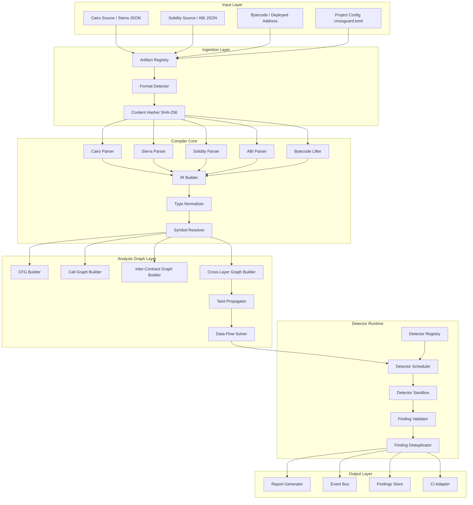
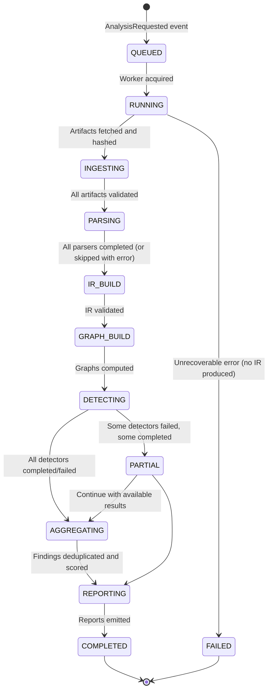
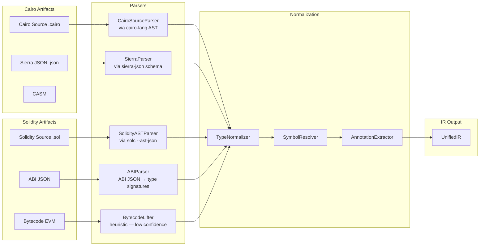
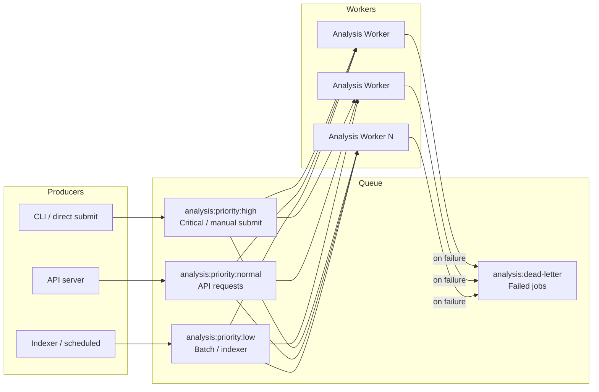
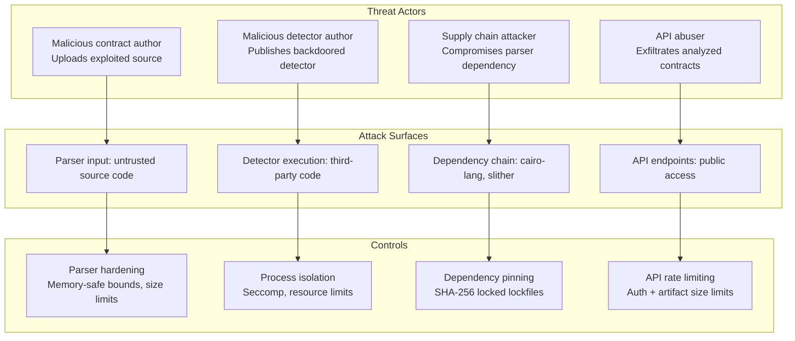
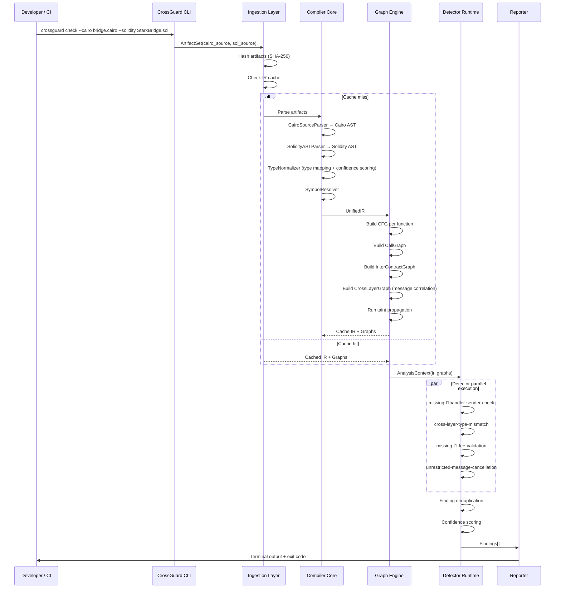
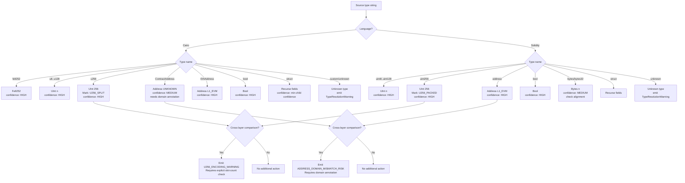

# CrossGuard — Production-Grade Architecture Blueprint

**Document type:** Internal RFC / Staff+ Architecture Review / Pre-implementation System Blueprint  
**Version:** 1.0  
**Status:** Draft for review  
**Audience:** Senior/Staff engineers, Compiler architects, Security researchers  
**Companion:** CrossGuard Product Concept Document v0.1

---

## Table of Contents

1. [Architecture Philosophy & Absolute Priorities](#1-architecture-philosophy--absolute-priorities)
2. [System Topology](#2-system-topology)
3. [Execution Model & Orchestration](#3-execution-model--orchestration)
4. [IR Pipeline — Compiler Core](#4-ir-pipeline--compiler-core)
   - 4.1 [Parsing Pipeline](#41-parsing-pipeline)
   - 4.2 [IR Layer Architecture](#42-ir-layer-architecture)
   - 4.3 [Type Normalization Engine](#43-type-normalization-engine)
   - 4.4 [CFG, Call Graph & Inter-Contract Graph](#44-cfg-call-graph--inter-contract-graph)
   - 4.5 [Cross-Layer Graph](#45-cross-layer-graph)
   - 4.6 [Data-Flow & Taint Analysis Substrate](#46-data-flow--taint-analysis-substrate)
5. [Cross-Layer Semantic Analysis Engine](#5-cross-layer-semantic-analysis-engine)
6. [Detector System Architecture](#6-detector-system-architecture)
   - 6.1 [Detector Runtime & Sandboxing](#61-detector-runtime--sandboxing)
   - 6.2 [Detector API Contract](#62-detector-api-contract)
   - 6.3 [Detector Categories & Algorithms](#63-detector-categories--algorithms)
7. [Graph & Analysis Engine](#7-graph--analysis-engine)
8. [Storage Architecture](#8-storage-architecture)
9. [Scalability Architecture](#9-scalability-architecture)
10. [Security Architecture](#10-security-architecture)
11. [Formal Verification Readiness](#11-formal-verification-readiness)
12. [AI Integration Boundaries](#12-ai-integration-boundaries)
13. [Mathematical & Theoretical Constraints](#13-mathematical--theoretical-constraints)
14. [CI/CD Integration Model](#14-cicd-integration-model)
15. [Module Contracts & API Specifications](#15-module-contracts--api-specifications)
16. [Architectural Decision Records (ADRs)](#16-architectural-decision-records-adrs)
17. [Threat Model](#17-threat-model)
18. [Risk Analysis & Open Questions](#18-risk-analysis--open-questions)

---

## 1. Architecture Philosophy & Absolute Priorities

### 1.1 What CrossGuard Is

CrossGuard is not a scanner. It is:

- A **compiler pipeline** that ingests multi-language source artifacts and produces a unified semantic model
- A **semantic normalization engine** that reconciles incompatible type systems across execution contexts
- A **security reasoning engine** that applies structured analyses over the unified model
- A **graph analysis platform** whose core data structure is an interprocedural, inter-contract, cross-layer directed graph
- A **formal verification substrate** designed to be extended with proof-carrying analysis without architectural change

This distinction is not rhetorical. It determines every structural decision: where boundaries are drawn, what gets persisted, what the extension model looks like, and what guarantees are made.

### 1.2 Priority Hierarchy

The following ordering is binding. Where tradeoffs exist, higher-priority properties win:

| Priority | Property | Implication |
|---|---|---|
| 1 | **Correctness** | A wrong finding is worse than no finding. Never sacrifice semantic accuracy for speed. |
| 2 | **Security rigor** | The analyzer itself is a security-critical artifact. It handles untrusted input. It must not be exploitable. |
| 3 | **Determinism** | Same inputs + same detectors = same outputs. Always. No PRNG, no wall-clock, no OS-dependent ordering without explicit seeding. |
| 4 | **Sound architecture** | Module boundaries must be real. Leaking abstraction across boundaries is a design defect, not a pragmatic shortcut. |
| 5 | **Extensibility** | New chains, new languages, new detectors must be addable without modifying existing core modules. |
| 6 | **Mathematical honesty** | False certainty is a security defect. Every finding carries explicit confidence bounds. Every undecidable region is labeled. |
| 7 | **Operational realism** | The architecture must be deployable, not theoretically beautiful. |
| 8 | **Scalability** | Design for scale, but do not pre-optimize. The scaling model must be correct. |
| 9 | **Developer ergonomics** | UX matters, but never at the expense of higher priorities. |

### 1.3 Non-Negotiable System Invariants

These invariants must hold for every analysis run. Violation is a product bug, not a configuration error:

- **I-1: Reproducibility.** Analysis is a pure function of `(artifact_set, detector_set, config)`. No side effects on the artifact. No timing dependencies.
- **I-2: Read-only analysis.** No detector may write to any artifact. The analysis substrate is immutable during a run.
- **I-3: Explicit partial analysis.** If required inputs for a detector are absent, the detector does not run silently — it emits a `DetectorSkipped` event with reason.
- **I-4: Severity is user-overridable, never auto-downgraded.** A detector that fires at CRITICAL stays CRITICAL unless the user explicitly suppresses it in config.
- **I-5: Every Finding has at least one Location.** A cross-layer finding has locations on both sides. Locationless findings are rejected at the finding validation layer.
- **I-6: Deterministic hashing of all artifacts.** Every artifact has a content-addressed ID. Two runs on identical files produce identical artifact IDs.

---

## 2. System Topology

### 2.1 High-Level Component Map



### 2.2 Deployment Topology (MVP → Scale)

**Phase 1 — Monolith CLI:**

```
[User Machine]
   └─ crossguard process
       ├─ Ingestion
       ├─ Compiler Core
       ├─ Analysis Engine
       ├─ Detector Runtime
       └─ Reporter
```

**Phase 2 — API + Worker:**

```
[Client]
   └─ HTTP → [FastAPI Server]
                 └─ enqueue → [Redis Queue]
                                  └─ [Worker Pool]
                                       ├─ Worker 1 (analysis)
                                       ├─ Worker 2 (analysis)
                                       └─ Worker N (analysis)
                                           └─ results → [PostgreSQL]
                                                             └─ [Report Server]
```

**Phase 3 — Distributed Analysis:**

```
[Indexer] → [Contract Queue]
                └─ [Analysis Coordinator]
                     ├─ [IR Build Workers] → [IR Cache (Redis/S3)]
                     └─ [Detector Workers] → [Findings DB (PostgreSQL)]
                                                  └─ [Public API]
```

The architectural seam between phases is the **event bus interface**. In Phase 1 it is an in-process synchronous event dispatcher. In Phase 2 it becomes a Redis stream. In Phase 3 it becomes a full message broker. The code that emits and consumes events does not change.

---

## 3. Execution Model & Orchestration

### 3.1 Analysis Run Lifecycle



### 3.2 Orchestration Contract

The `AnalysisPipeline` orchestrator is the only component with global view of a run. Its contract:

```python
class AnalysisPipeline:
    """
    Orchestrates a single AnalysisRun.
    
    Invariants:
    - All stages execute in the defined order.
    - Stage failures are caught and classified as recoverable or terminal.
    - Terminal failures abort the run with FAILED status.
    - Recoverable failures produce PARTIAL status with explicit reason list.
    - No stage has access to another stage's internal state; only its outputs.
    - The pipeline is stateless between runs; all state lives in AnalysisContext.
    """
    
    def execute(self, context: AnalysisContext) -> AnalysisRun:
        ...
```

### 3.3 AnalysisContext — The Run's Blackboard

```python
@dataclass(frozen=True)
class AnalysisContext:
    run_id: UUID
    artifacts: FrozenSet[Artifact]         # immutable after ingestion
    config: AnalysisConfig                 # immutable for lifetime of run
    ir: Optional[UnifiedIR]                # set after IR build stage
    graphs: Optional[AnalysisGraphBundle]  # set after graph build stage
    events: EventBus                       # for emitting lifecycle events
    
    # Derived: content-addressed cache key for this entire analysis
    @property
    def cache_key(self) -> str:
        return sha256(
            sorted(a.checksum for a in self.artifacts),
            sorted(d.id + d.version for d in self.config.detectors)
        ).hex()
```

The `AnalysisContext` is immutable except for the staged additions of `ir` and `graphs`, which are set once and never modified. This prevents detectors from affecting each other's view of the world.

### 3.4 Concurrency Model

**Within a single run:**
- Parsing stages for L1 and L2 artifacts are parallel (independent parsers)
- IR build is sequential (requires both parsed artifacts)
- Graph construction is partially parallel (CFG per function, then join)
- Detector execution is parallel (detectors are isolated units with read-only IR access)
- Reporting is sequential (requires all findings)

**Implementation:** Python `concurrent.futures.ProcessPoolExecutor` for detectors (not threads — detectors must be truly isolated for security). IR build uses threads for parser-level parallelism since it is CPU-bound but trusted code.

**Determinism guarantee:** Detector scheduling uses a topological sort of the detector dependency graph seeded by a deterministic hash. Results are collected in sorted order by detector ID. Finding IDs are content-addressed, not random.

---

## 4. IR Pipeline — Compiler Core

### 4.1 Parsing Pipeline

The parsing pipeline transforms raw source artifacts into language-specific ASTs, which are then lifted to a unified IR. The architecture treats each parser as an isolated, replaceable component.



**Parser priority rules:**
- If Sierra JSON is available, prefer it over Cairo source for function-level analysis (Sierra is the compiler's canonical output)
- If both Sierra and Cairo source are available, build IR from Sierra and annotate with source locations from Cairo
- If only ABI is available (no source), produce a reduced IR with type information only; detectors must check `ir.completeness_level` before running
- Bytecode lifting is last resort; all findings from bytecode-derived IR carry `confidence: LOW`

**Parser boundary contract:**

Each parser implements:

```python
class Parser(Protocol):
    source_formats: FrozenSet[ArtifactFormat]
    output_type: Type[LanguageAST]
    
    def parse(self, artifact: Artifact) -> ParseResult:
        """
        Returns ParseResult.ok(ast) or ParseResult.err(ParseError).
        MUST NOT raise exceptions that cross the module boundary.
        MUST complete within config.parser_timeout_ms.
        MUST handle malformed input gracefully (return ParseError, not crash).
        """
        ...
    
    def version(self) -> str:
        """Returns the parser version for reproducibility tracking."""
        ...
```

**Sierra parser specifics:**

Sierra JSON (the output of the Cairo compiler) is the canonical representation for deployed/compiled Cairo contracts. It contains:
- Function signatures with parameter types as Sierra type IDs
- The function body as a flat list of Sierra statements (SSA-like)
- A type registry mapping type IDs to concrete type definitions
- Debug information (optionally, if compiled with `--debug-info`)

The `SierraParser` must:
1. Validate the Sierra JSON against the versioned schema before any processing
2. Reject Sierra versions outside the supported range with an explicit error (not silent degradation)
3. Extract `#[l1_handler]` annotations from the Sierra attribute system
4. Map Sierra types to `IRType` using the type normalization rules in §4.3

**Critical:** Sierra format has evolved across Cairo compiler versions. The parser must track `compiler_version` from the Sierra JSON metadata and apply version-specific parsing rules. This is not optional — type encodings differ between versions.

### 4.2 IR Layer Architecture

The IR uses a three-layer design to balance expressiveness, stability, and extensibility:

```
┌─────────────────────────────────────────────────────────┐
│  Layer 3: Cross-Layer IR                                 │
│  MessageFlowGraph, CrossLayerBinding, TrustDomain        │
├─────────────────────────────────────────────────────────┤
│  Layer 2: Contract-Level IR                              │
│  InterContractGraph, CallGraph, StorageModel             │
├─────────────────────────────────────────────────────────┤
│  Layer 1: Function-Level IR                              │
│  CFG, IRFunction, IRBlock, SSA, DataFlowGraph            │
└─────────────────────────────────────────────────────────┘
```

Detectors operate at the layer appropriate to their analysis. A missing-sender-check detector needs only Layer 1 (function body analysis). A payload compatibility detector needs Layer 3. Most cross-layer detectors need all three.

**Core IR types:**

```python
@dataclass(frozen=True)
class UnifiedIR:
    """
    The root of the unified intermediate representation.
    Immutable once constructed. Content-addressed by hash of constituent IRContracts.
    """
    contracts: Tuple[IRContract, ...]
    cross_layer_bindings: Tuple[CrossLayerBinding, ...]
    ir_version: str                        # semantic version of the IR schema
    source_languages: FrozenSet[Language]
    completeness_level: IRCompletenessLevel  # FULL | PARTIAL_SOURCE_ONLY | ABI_ONLY | BYTECODE_ONLY
    provenance: IRProvenance               # which parsers produced this IR and their versions


@dataclass(frozen=True)
class IRContract:
    id: str                                # content-addressed: sha256(canonical_source)
    language: Language                     # CAIRO | SOLIDITY | VYPER | ...
    name: str
    functions: Tuple[IRFunction, ...]
    storage_vars: Tuple[IRStorageVar, ...]
    events: Tuple[IREvent, ...]
    constructor: Optional[IRFunction]
    interfaces_implemented: Tuple[str, ...]
    annotations: FrozenSet[str]            # contract-level annotations
    layer: ChainLayer                      # L1 | L2


@dataclass(frozen=True)
class IRFunction:
    id: str                                # qualified name + parameter type hash
    name: str
    visibility: Visibility                 # PUBLIC | EXTERNAL | INTERNAL | PRIVATE
    mutability: Mutability                 # VIEW | PURE | NONPAYABLE | PAYABLE
    annotations: FrozenSet[str]            # e.g. {"l1_handler", "external", "view"}
    parameters: Tuple[IRParam, ...]
    return_types: Tuple[IRType, ...]
    cfg: Optional[ControlFlowGraph]        # None if only ABI-level info available
    calls: Tuple[IRCall, ...]
    storage_reads: Tuple[IRStorageAccess, ...]
    storage_writes: Tuple[IRStorageAccess, ...]
    taint_summary: Optional[TaintSummary]  # populated by taint propagation pass
    

@dataclass(frozen=True)
class IRParam:
    name: str
    normalized_type: IRType
    source_type_string: str                # original type as written in source
    position: int
    is_implicit: bool                      # e.g. Cairo implicit params (syscall_ptr)


@dataclass(frozen=True)
class CrossLayerBinding:
    """
    Represents the semantic connection between an L1 function and an L2 handler,
    or vice versa. This is the core abstraction for cross-layer analysis.
    """
    id: str
    l1_side: CrossLayerEndpoint
    l2_side: CrossLayerEndpoint
    messaging_protocol: MessagingProtocol  # STARKNET_NATIVE | HYPERLANE | LAYERZERO | CUSTOM
    direction: MessageDirection            # L1_TO_L2 | L2_TO_L1 | BIDIRECTIONAL
    payload_correlation: PayloadCorrelation  # how L1 payload maps to L2 parameters
    confidence: BindingConfidence          # HIGH | MEDIUM | LOW | INFERRED
    binding_evidence: Tuple[BindingEvidence, ...]  # what evidence was used to create this binding
```

### 4.3 Type Normalization Engine

Type normalization is the hardest correctness problem in CrossGuard. It sits at the intersection of two incompatible type systems that were independently designed.

#### Canonical Type Lattice

```
IRType (canonical)
├── Primitive
│   ├── UInt(bit_width: 8|16|32|64|128|256)
│   ├── Int(bit_width: 8|16|32|64|128|256)    # signed
│   ├── Bool
│   ├── Address(domain: L1_EVM | L2_STARKNET | UNKNOWN)
│   ├── Bytes(length: int | DYNAMIC)
│   ├── Felt252                               # Starknet-native, no EVM equivalent
│   └── ContractClass                         # Starknet-native
├── Composite
│   ├── Struct(fields: Tuple[IRField, ...])
│   ├── Array(element_type: IRType, length: int | DYNAMIC)
│   ├── Tuple(element_types: Tuple[IRType, ...])
│   └── Option(inner_type: IRType)            # Cairo Option<T>
├── Special
│   ├── Unknown(source_repr: str)             # cannot be resolved
│   └── Ambiguous(candidates: Tuple[IRType, ...], rationale: str)  # multiple valid mappings
```

#### Starknet Type Mapping Rules

The following mappings are applied by the `TypeNormalizer`. Each mapping carries an explicit `MappingConfidence` and `MappingRationale`:

| Source (Cairo) | Source (Solidity) | Canonical IR Type | Confidence | Caveats |
|---|---|---|---|---|
| `felt252` | — | `Felt252` (preserved) | HIGH | No direct EVM equivalent; requires semantic annotation |
| `u8` | `uint8` | `UInt(8)` | HIGH | Direct equivalence |
| `u16` | `uint16` | `UInt(16)` | HIGH | Direct equivalence |
| `u32` | `uint32` | `uint32` | `UInt(32)` | HIGH | Direct equivalence |
| `u64` | `uint64` | `UInt(64)` | HIGH | Direct equivalence |
| `u128` | `uint128` | `UInt(128)` | HIGH | Direct equivalence |
| `u256` | `uint256` | `UInt(256)` | HIGH | But encoding differs — see §4.3.1 |
| `ContractAddress` | `address` | `Address(UNKNOWN)` | **MEDIUM** | 160-bit vs 251-bit — see §4.3.2 |
| `EthAddress` | `address` | `Address(L1_EVM)` | HIGH | Cairo explicit L1 address wrapper |
| `bool` | `bool` | `Bool` | HIGH | |
| `ByteArray` | `bytes` | `Bytes(DYNAMIC)` | MEDIUM | Cairo ByteArray is not raw bytes |
| `Span<felt252>` | `uint256[]` | `Array(Felt252, DYNAMIC)` | LOW | Structural match only, semantic unknown |
| Custom struct | Custom struct | `Struct(...)` (recursive) | MEDIUM | Field-by-field recursive mapping |

#### 4.3.1 u256 Encoding Mismatch

This is a concrete, documented source of bugs.

In Cairo, `u256` is defined as:
```rust
struct u256 { low: u128, high: u128 }
```

When serialized as a Starknet message payload, it occupies **two `felt252` slots**: `[low, high]`.

In Solidity, `uint256` is a single 32-byte big-endian integer.

When a Solidity contract encodes a `uint256` and sends it as an L1→L2 message, the Cairo receiver must correctly split it into `(low, high)`. If the developer gets the byte ordering wrong, values above `2^128 - 1` will be silently corrupted.

The type normalizer must:
1. Detect when a `UInt(256)` crosses the L1↔L2 boundary in either direction
2. Attach a `U256_ENCODING_WARNING` annotation to the binding
3. The cross-layer type compatibility detector must treat this as requiring explicit serialization verification

#### 4.3.2 Address Width Problem

- Ethereum addresses: 160 bits (20 bytes)  
- Starknet contract addresses: 251-bit field elements

These are not interchangeable. The cross-layer serialization protocol uses `felt252` to represent both, which means:
- An Ethereum address can be losslessly embedded in a `felt252` (160 < 252)
- A Starknet address **cannot** always be represented as an Ethereum `address` type — truncation may occur

The TypeNormalizer represents cross-domain addresses as `Address(UNKNOWN)` and flags any direct comparison or storage of a cross-domain address without explicit domain annotation as a `TRUST_BOUNDARY` finding.

**Confidence scoring protocol:**

Every `IRType` produced by the normalizer carries a `type_confidence: float [0.0, 1.0]` and a `type_confidence_rationale: str`. This is not optional metadata — it is load-bearing for detector logic. Detectors that require `HIGH` confidence (≥ 0.8) must check this field before firing.

#### 4.3.3 Unknown Type Handling

When the normalizer cannot resolve a type mapping:
1. The type is represented as `Unknown(source_repr=original_string)`
2. A `TypeResolutionWarning` is emitted on the event bus
3. Detectors that encounter `Unknown` types in cross-layer positions must:
   - Either emit a `MANUAL_REVIEW_REQUIRED` finding at MEDIUM severity
   - Or explicitly document in their logic why `Unknown` is safe to ignore

**No detector may silently skip analysis because of an Unknown type. Silence is forbidden.**

### 4.4 CFG, Call Graph & Inter-Contract Graph

#### Control Flow Graph (CFG)

Built per-function from the Sierra or Solidity AST. Sierra's SSA-like structure makes CFG construction relatively straightforward:

```python
@dataclass
class ControlFlowGraph:
    function_id: str
    entry_block: BasicBlock
    blocks: Dict[BlockId, BasicBlock]
    edges: List[CFGEdge]  # (source_block, target_block, edge_type: UNCONDITIONAL|TRUE_BRANCH|FALSE_BRANCH|EXCEPTION)
    exit_blocks: FrozenSet[BlockId]


@dataclass
class BasicBlock:
    id: BlockId
    instructions: Tuple[IRInstruction, ...]
    phi_nodes: Tuple[PhiNode, ...]  # SSA phi nodes, if SSA form is used
```

**SSA form:** For data-flow analysis quality, function-level IR should be in SSA (Static Single Assignment) form. Sierra is already approximately SSA. For Solidity, we construct SSA from the AST via the standard algorithm (insert phi nodes at dominance frontiers). SSA enables:
- More precise def-use chains
- Simpler taint propagation (each variable has exactly one definition)
- More accurate reaching-definition analysis

SSA is not required for the MVP pattern-matching detectors, but the IR should be designed to support it from day one. The `PhiNode` field in `BasicBlock` is reserved; MVP can leave it empty.

#### Call Graph

```python
@dataclass
class CallGraph:
    nodes: Dict[FunctionId, CallNode]
    edges: List[CallEdge]
    
    # For virtual/dynamic calls that cannot be statically resolved:
    unresolved_calls: List[UnresolvedCall]  # each has a rationale for why it's unresolvable
```

**Starknet-specific:** Cairo's `call_contract_syscall` is a dynamic dispatch mechanism. The target address is a runtime value. The call graph must represent these as `UnresolvedCall` nodes with `dispatch_type: DYNAMIC`. This is a fundamental static analysis limitation (see §13).

#### Inter-Contract Graph

```python
@dataclass
class InterContractGraph:
    """
    Connects contracts within the same analysis target.
    Distinct from the cross-layer graph, which connects L1 to L2.
    """
    nodes: Dict[ContractId, ICGNode]
    edges: List[ICGEdge]  # (caller_contract, caller_function, callee_contract, callee_function, call_type)
    
    # Proxy resolution: maps proxy contracts to their implementation contracts
    proxy_resolutions: Dict[ContractId, ContractId]
```

### 4.5 Cross-Layer Graph

The cross-layer graph is the most distinctive element of CrossGuard's architecture and the primary differentiator from existing tools.

```python
@dataclass
class CrossLayerGraph:
    """
    Represents the complete messaging topology between L1 and L2 contracts.
    This graph is the core analytical structure for cross-layer detectors.
    """
    l1_nodes: Dict[FunctionId, CLGNode]
    l2_nodes: Dict[FunctionId, CLGNode]
    message_edges: List[MessageEdge]
    
    # Trust domains: which addresses are considered trusted sources
    trust_domains: Dict[LayerSide, TrustDomain]
    
    # Message lifecycle: tracks the full path of a message from send to consume
    message_lifecycles: List[MessageLifecycle]


@dataclass
class MessageEdge:
    id: str
    source: CLGNode                          # sending function
    target: CLGNode                          # receiving function (l1_handler or consumeMessageFromL2)
    direction: MessageDirection
    payload_schema: PayloadSchema            # normalized type sequence of the message
    sender_verification: SenderVerification  # VERIFIED | UNVERIFIED | PARTIAL | UNKNOWN
    fee_handling: FeeHandling                # FEE_FORWARDED | FEE_MISSING | NOT_APPLICABLE
    cancellation_path: Optional[CancellationPath]
    confidence: float


@dataclass
class MessageLifecycle:
    """
    Traces the complete lifecycle of a message type through the system.
    Used for liveness analysis and async state machine reasoning.
    """
    message_id: str
    send_points: List[SendPoint]            # where messages of this type are sent
    receive_points: List[ReceivePoint]      # where they are received
    cancellation_points: List[CancellationPoint]
    can_be_replayed: bool                   # replay risk analysis
    can_be_stuck: bool                      # liveness analysis
    stuck_conditions: List[StuckCondition]  # conditions under which message gets stuck
```

**Cross-layer binding inference algorithm:**

Binding L1 functions to L2 handlers is a non-trivial analysis problem. The binding confidence depends on available evidence:

| Evidence type | Confidence contribution |
|---|---|
| Explicit address constant in source: `from_address == 0x...` | HIGH |
| ABI-matching payload types between sender and receiver | MEDIUM |
| Constructor-stored address used in check | MEDIUM |
| Naming conventions (e.g., function name matching) | LOW |
| No evidence (structurally possible binding) | SPECULATIVE |

Speculative bindings are flagged in the output and do not trigger CRITICAL/HIGH findings unless corroborated by other evidence.

### 4.6 Data-Flow & Taint Analysis Substrate

Taint analysis tracks the propagation of untrusted data through the contract's execution paths.

**Taint sources (L1→L2 context):**
- All parameters of `#[l1_handler]` functions (these come from L1 and should be treated as untrusted until verified)
- Specifically: `from_address` (the claimed sender), all payload parameters

**Taint sinks (what we care about protecting):**
- Calls to privileged functions (e.g., `transfer`, `mint`, `set_admin`)
- Storage writes that affect balances or authorization state
- Calls to other contracts via `call_contract_syscall`
- Fee/value transfers

**Sanitizers (what clears the taint):**
- Explicit equality check against a trusted constant or storage variable: `assert(from_address == expected_l1_contract)`
- Verified comparison with revert-on-failure semantics

**Taint propagation rules:**
- Taint flows through assignments: `let x = tainted_var` → `x` is tainted
- Taint flows through arithmetic: `let y = tainted_var + 1` → `y` is tainted
- Taint is sanitized at assertion boundaries with explicit exit paths
- Taint does NOT flow through cryptographic hashes when the hash output is only used as a key lookup (not as a direct value comparison with a sensitive resource)

**Implementation approach (MVP):**

For MVP, implement a simplified forward taint analysis using worklist algorithm over the CFG:
1. Initialize taint set at `#[l1_handler]` parameter definitions
2. Propagate forward through CFG edges
3. At each potentially sanitizing assertion, check if the tainted variable is compared against a trusted value
4. At each sink, check if any argument is in the taint set
5. Report untainted-sink reaching tainted-source paths as findings

The taint analysis substrate must support the `TaintSummary` attached to each `IRFunction`, which allows inter-procedural propagation without full re-analysis of called functions.

---

## 5. Cross-Layer Semantic Analysis Engine

This engine is responsible for reasoning about the semantic correctness of cross-layer communication as a unified system. It builds on the Cross-Layer Graph and produces the analyses that no single-language tool can perform.

### 5.1 Message Correlation Engine

**Problem:** Given an L1 contract that sends messages via `StarknetCore.sendMessageToL2()` and an L2 contract with `#[l1_handler]` functions, determine which sends correspond to which handlers, and whether the correlation is semantically correct.

**Algorithm:**

```
MessageCorrelation:
1. Enumerate all L1 call sites to sendMessageToL2(toAddress, selector, payload)
2. Enumerate all L2 #[l1_handler] functions
3. For each (send_site, handler) pair:
   a. Check: does send_site.toAddress match the L2 contract address?
      - If address is a constant: HIGH confidence match
      - If address is a constructor param: MEDIUM confidence match
      - If address is dynamic: LOW confidence, flag DYNAMIC_ROUTING
   b. Check: does send_site.selector match the handler's function selector?
      - Selector is keccak256(function_sig) truncated to felt252
   c. Check: does send_site.payload type sequence match handler parameters?
      → PayloadCompatibilityResult
4. Build MessageEdge for each correlated pair
5. Flag uncorrelated send sites (sends with no known handler) as ORPHAN_SEND
6. Flag uncorrelated handlers (handlers with no known sender) as ORPHAN_HANDLER
```

### 5.2 Payload Equivalence Analysis

For each correlated message pair, verify structural and semantic equivalence of the payload:

```python
def analyze_payload_equivalence(
    l1_payload: Tuple[SolidityType, ...],
    l2_params: Tuple[IRParam, ...],
    encoding_context: StarknetEncodingContext
) -> PayloadEquivalenceResult:
    """
    Checks that the payload encoded by the L1 sender matches
    the parameters expected by the L2 handler.
    
    Encoding rules for Starknet L1→L2:
    - Each EVM type is encoded as a sequence of felt252 values
    - uint256 → 2 felt252 values (low, high)
    - address → 1 felt252 value
    - bytes → N felt252 values (length + chunks)
    - Nested structs are flattened
    
    Returns:
    - EQUIVALENT: types match at all positions
    - MISMATCH(position, l1_type, l2_type): specific mismatch found
    - AMBIGUOUS: types are structurally compatible but semantically uncertain
    - INSUFFICIENT_INFO: cannot determine due to missing type info
    """
```

**Serialization slot counting:**

A key check is that the number of `felt252` slots consumed by the L1 payload equals the total number of parameter slots on the L2 side. Off-by-one errors here cause the L2 handler to read the wrong values silently (no runtime error).

Slot count rules:
- `uint8` through `uint128`, `address`, `bool`: 1 slot each
- `uint256`: 2 slots (high, low — order matters)
- `bytes32`: 1 slot if it fits in 252 bits, otherwise triggers a warning
- Arrays: 1 (length) + N * (element_slots)
- Structs: sum of field slots (recursive)

### 5.3 Sender Trust Verification

```python
def analyze_sender_trust(
    handler: IRFunction,
    cross_layer_graph: CrossLayerGraph
) -> SenderTrustResult:
    """
    Verifies that an #[l1_handler] function correctly verifies
    the from_address parameter before trusting any payload data.
    
    Pattern categories:
    - VERIFIED_CONSTANT: assert(from_address == 0x<constant>)
    - VERIFIED_STORAGE: assert(from_address == storage.l1_contract_address)
    - VERIFIED_ALLOWLIST: from_address in allowed_senders (map/array)
    - UNVERIFIED: from_address never checked before privileged operations
    - PARTIAL: checked on some execution paths but not all
    - VERIFIED_BUT_BYPASSABLE: check exists but can be bypassed (e.g., in dead code)
    """
```

**Path-sensitive analysis:** The sender trust check must be path-sensitive. A check that exists only on one branch of a conditional does not protect all execution paths. The analysis must enumerate all paths from function entry to each privileged sink and verify that every path passes through a sender verification point.

**Complexity note:** Path enumeration is potentially exponential in the number of conditionals (see §13). For MVP, limit to paths ≤ N hops (configurable, default 10) and emit `ANALYSIS_DEPTH_LIMIT` when this bound is reached.

### 5.4 Authorization Propagation

Authorization state from L1 should not implicitly grant elevated permissions on L2. CrossGuard analyzes whether:
1. A trusted L1 sender causes an L2 function to behave differently than an untrusted sender
2. This behavioral difference is intentional (correct design) or accidental (authorization confusion)

This analysis is heuristic and produces MEDIUM confidence findings. It requires human review.

### 5.5 Replay Risk Analysis

L1→L2 messages in Starknet are delivered exactly-once by the protocol. However:
- L2→L1 messages require explicit `consumeMessageFromL2` calls on L1
- An L1 consumer can consume the same L2 message multiple times if the L2 side doesn't track consumed messages

```python
def analyze_replay_risk(
    lifecycle: MessageLifecycle,
    l1_ir: IRContract,
    l2_ir: IRContract
) -> ReplayRiskResult:
    """
    Checks:
    1. For L2→L1: Does the L2 sender maintain a 'sent' flag or nonce?
    2. For L2→L1: Does the L1 consumer check for replay?
       (consumeMessageFromL2 is one-time by protocol — replay risk is on the application layer)
    3. For L1→L2: Are there mechanisms that could cause message retransmission?
    """
```

### 5.6 Cancellation Safety Analysis

L1→L2 messages in Starknet can be cancelled by the L1 sender after a time delay, if the message has not been consumed. This creates a griefing vector:
- Attacker initiates a legitimate-looking L1→L2 action
- L2 side processes the message and changes state
- Attacker cancels the message before consumption → funds may be lost or state inconsistent

CrossGuard checks:
- Whether cancellation of pending messages is restricted to the original sender
- Whether the contract's state machine handles the CANCELLED message state correctly
- Whether there are assets locked on L2 that depend on uncancelled L1 messages

---

## 6. Detector System Architecture

### 6.1 Detector Runtime & Sandboxing

#### Why process isolation is required

Detectors are potentially community-contributed code that runs on untrusted contract source code. Two attack surfaces exist:
1. A malicious detector attempting to exfiltrate analyzed contract source (supply chain attack)
2. Maliciously crafted contract code exploiting a vulnerability in the detector logic (parser/analyzer exploitation)

**Process isolation model:**

```
[Analysis Engine Process]
    │
    ├─ fork() → [Detector Worker Process]
    │                ├─ seccomp-bpf filter: restrict syscalls to read-only set
    │                ├─ No network access (SECCOMP_DENY_CONNECT)
    │                ├─ No filesystem write access (read-only bind mounts)
    │                ├─ Resource limits: CPU time, memory (configurable per-detector)
    │                ├─ Receives: read-only serialized IR over pipe
    │                └─ Returns: serialized Finding[] over pipe
    │
    └─ Collects findings via IPC pipe
```

For MVP (single-user CLI), full seccomp isolation may be omitted, but the IPC boundary (serialize IR → pass to detector → receive findings) **must** be maintained. The security properties are progressively added; the API contract must not change.

**Detector versioning:**

Every detector has a semver identifier. The analysis run records `detector_id:version` for every detector used. This is required for reproducibility — a finding from `missing-l1handler-sender-check@1.0.0` may not be produced by `@1.1.0` if the detector logic changed.

#### Resource limits

| Resource | Default limit | Rationale |
|---|---|---|
| CPU time | 30s per detector | Prevents infinite loops in pathological contracts |
| Memory | 512MB per detector | Prevents OOM from large contract graphs |
| Wall clock | 60s per detector | Includes any I/O |
| IR access depth | Configurable, default 50 | Prevents stack overflow in recursive IR traversal |

When a detector exceeds its resource limit, the run produces a `DetectorTimeout` finding (SEVERITY: INFO, CATEGORY: ANALYSIS_LIMITATION) rather than silently skipping.

### 6.2 Detector API Contract

```python
class Detector(ABC):
    """
    The complete API contract for all detectors.
    Detectors MUST implement all abstract methods.
    Detectors MUST NOT:
    - Access any global state
    - Perform I/O (network, filesystem) other than reading the provided IR
    - Modify the IR
    - Spawn processes or threads
    - Use randomness (breaks determinism)
    - Depend on execution order relative to other detectors
    """
    
    @property
    @abstractmethod
    def id(self) -> str:
        """Stable slug identifier. Never changes after publication."""
        ...
    
    @property
    @abstractmethod
    def version(self) -> str:
        """Semver. Increment minor for behavior changes, major for breaking API changes."""
        ...
    
    @property
    @abstractmethod
    def category(self) -> DetectorCategory:
        ...
    
    @property
    @abstractmethod
    def target_layer(self) -> TargetLayer:
        """L1_ONLY | L2_ONLY | CROSS_LAYER. Determines which IR halves are required."""
        ...
    
    @property
    @abstractmethod
    def required_ir_completeness(self) -> IRCompletenessLevel:
        """Minimum IR completeness required. Runner checks before invoking."""
        ...
    
    @abstractmethod
    def analyze(self, context: DetectorContext) -> DetectorResult:
        """
        Core analysis method.
        
        Must be:
        - Pure: same context → same result
        - Bounded: respects resource limits
        - Fail-safe: returns DetectorResult.error() rather than raising
        
        MUST NOT raise unhandled exceptions.
        """
        ...
    
    def generate_autofix(self, finding: Finding) -> Optional[AutofixSuggestion]:
        """
        Optional. Returns a code transformation suggestion.
        The suggestion is non-executable (presented to developer for review only).
        Default: None
        """
        return None
    
    def formal_spec(self) -> Optional[FormalSpecification]:
        """
        Optional. Returns a formal specification of what this detector checks.
        Used by the formal verification extension (see §11).
        Default: None
        """
        return None


@dataclass
class DetectorContext:
    """Read-only view of the analysis context provided to each detector."""
    
    # IR access
    ir: UnifiedIR                          # read-only
    cross_layer_graph: CrossLayerGraph     # read-only
    
    # Graph traversal helpers
    graph_api: GraphTraversalAPI           # see §7
    
    # Analysis run metadata
    run_id: UUID
    config: DetectorConfig
    
    # Evidence generation helpers
    evidence_builder: EvidenceBuilder
    
    # Finding construction
    finding_builder: FindingBuilder


@dataclass
class DetectorResult:
    detector_id: str
    detector_version: str
    status: DetectorStatus               # COMPLETED | FAILED | SKIPPED | TIMEOUT
    findings: Tuple[Finding, ...]
    errors: Tuple[DetectorError, ...]    # non-fatal errors that occurred during analysis
    execution_time_ms: int
    resource_usage: ResourceUsage
```

#### Evidence model

Every finding must be backed by machine-verifiable evidence. This is critical for:
- Minimizing false positive reports (auditors can verify the reasoning)
- Future formal verification integration (evidence becomes proof obligation)
- Reproducibility (findings can be re-derived from evidence alone)

```python
@dataclass(frozen=True)
class FindingEvidence:
    evidence_type: EvidenceType
    # Types: CODE_PATH | IR_NODE | GRAPH_PATH | TYPE_MISMATCH | MISSING_CHECK | REACHABILITY
    
    locations: Tuple[Location, ...]        # source locations involved
    ir_nodes: Tuple[IRNodeRef, ...]        # referenced IR nodes
    graph_path: Optional[GraphPath]        # path through the analysis graph
    explanation: str                       # human-readable explanation of the evidence
    
    # Machine-readable: can be replayed by the analysis engine to verify
    derivation: EvidenceDerivation
```

### 6.3 Detector Categories & Algorithms

#### Category 1: AUTHORIZATION — Missing Sender Verification

**Core detector:** `missing-l1handler-sender-check`

**Algorithm:**
1. Find all functions annotated with `#[l1_handler]` in L2 IR
2. For each such function:
   a. Identify the `from_address` parameter (position 0 by Starknet convention)
   b. Run taint analysis: is `from_address` used as input to a comparison with a constant or trusted storage value **before** any privileged operation?
   c. Check that the comparison uses `==` with revert-on-failure (via `assert!` or equivalent)
   d. Verify path coverage: does the check cover all execution paths to all privileged sinks?
3. Report any handler where the check is absent, incomplete, or bypassable

**Complexity:** O(|CFG nodes| × |taint set size|) per function. For typical contracts, bounded by practical function size.

**False positive risk:** Medium. The most common false positive is a function that is intentionally callable by anyone (e.g., a relay that simply logs messages). Mitigation: cross-reference with function name and documentation; emit LOW confidence if the handler has no privileged operations.

**Fundamental static analysis limitation:** Dynamic dispatch — if `from_address` is compared against a value retrieved via `call_contract_syscall` (e.g., from an address registry), static analysis cannot determine the value. Emit `MANUAL_REVIEW: dynamic_address_verification` finding.

---

#### Category 2: TYPE_SAFETY — Encoding Mismatch

**Core detector:** `cross-layer-type-mismatch`

**Algorithm:**
1. For each `MessageEdge` in the `CrossLayerGraph`:
2. Extract L1 `payload` parameter types from the Solidity call site
3. Extract L2 `#[l1_handler]` parameter types from the Cairo IR
4. Run `analyze_payload_equivalence()` (see §5.2)
5. Check slot count equivalence
6. For each position mismatch: emit CRITICAL finding with specific mismatch description
7. For `uint256` / `u256` crossings: emit HIGH finding with u256-encoding warning

**Complexity:** O(|payload_fields|) per message edge. Struct nesting: O(depth × fields).

**False positive risk:** Low for direct type mismatches. Medium for u256 encoding warnings (developer may have correctly implemented the split/join).

**Limitation:** Cannot verify the correctness of custom encode/decode functions without data-flow analysis. For MVP: flag calls through custom encode functions as requiring manual review.

---

#### Category 3: ASSET_SAFETY — Fee Validation

**Core detector:** `missing-l1-fee-validation`

**Algorithm:**
1. Find all Solidity call sites to `StarknetCore.sendMessageToL2(toAddress, selector, payload)`
2. For each call site, check: is `msg.value` forwarded as the `l1_to_l2_message_nonce` fee parameter?
   - The Starknet messaging contract requires payment of the message fee
   - If fee is 0 or not forwarded, the message will fail silently on L2
3. Check for the `l1_to_l2_message_nonce` return value being used or discarded

**Complexity:** O(|call_sites|). Simple pattern match.

**False positive risk:** Low. Fee requirement is a protocol property.

---

#### Category 4: LIVENESS — Cancellation Access Control

**Core detector:** `unrestricted-message-cancellation`

**Algorithm:**
1. Find all calls to `StarknetCore.startL1ToL2MessageCancellation()` in L1 IR
2. Verify that the call is protected by an access control check
3. Specifically: is the caller of the cancellation restricted to `msg.sender == original_sender` or an admin role?
4. If cancellation is callable by any address: emit HIGH finding

---

#### Category 5: REENTRANCY — Cross-Layer Reentrancy

**Core detector:** `cross-layer-reentrancy`

**Note:** This is a research-frontier detector. Cross-layer reentrancy is substantially more complex than single-contract reentrancy because the re-entry path involves the L1 messaging system.

**Pattern to detect:**
```
L2 contract sends L2→L1 message
  → L1 contract receives and calls back via sendMessageToL2
    → L2 contract receives l1_handler call before completing original execution
```

**Static limitation:** This pattern requires reasoning about asynchronous state — the L2 handler may be called in a future block, not immediately. Pure static analysis cannot determine if state is correctly protected across async boundaries. This detector must be labeled as HEURISTIC with HIGH false-positive rate. Emit MEDIUM confidence findings only.

---

#### Algorithmic complexity summary

| Detector | Algorithm | Best Case | Worst Case | Notes |
|---|---|---|---|---|
| missing-l1handler-sender-check | Taint + path coverage | O(n) | O(n × p) paths | p = path count, bounded by depth limit |
| cross-layer-type-mismatch | Type lattice comparison | O(m) | O(m × d) nesting | m = message fields, d = struct depth |
| missing-l1-fee-validation | Pattern match | O(c) | O(c) | c = call sites |
| unrestricted-message-cancellation | Access control pattern | O(c) | O(c) | |
| cross-layer-reentrancy | Async state machine | O(s) | O(s × 2^k) | k = conditionals, requires depth limit |

---

## 7. Graph & Analysis Engine

### 7.1 Core Graph Algorithms

**Interprocedural analysis** is required for any finding that spans multiple functions. CrossGuard implements summary-based interprocedural analysis:

1. Analyze each function in isolation, producing a `FunctionSummary`
2. Propagate summaries across call edges (bottom-up in call graph topological order)
3. Re-analyze callers using callee summaries

This avoids full inlining (which causes path explosion) while preserving interprocedural precision.

**Fixed-point iteration:**

For taint propagation and data-flow analysis, CrossGuard uses a standard monotone framework with fixed-point iteration:

```
Initialize: all facts = bottom (empty taint set, empty reaching defs)
Repeat:
  for each function in worklist:
    compute output facts from input facts using transfer functions
    if output changed: add successors to worklist
Until: no output changes (fixed point)
```

Convergence is guaranteed because:
- The lattice is finite (bounded by the number of IR nodes)
- Transfer functions are monotone

**Convergence rate:** For typical smart contracts (small CFGs), this converges in 2-5 iterations. Worst case: O(|nodes|) iterations for heavily connected graphs.

### 7.2 Path Explosion Mitigation

Path enumeration is exponential in the number of conditionals. CrossGuard uses several mitigation strategies:

| Strategy | Mechanism | Tradeoff |
|---|---|---|
| Depth limiting | Max path length N (default 10) | May miss long paths; emit `DEPTH_LIMIT_REACHED` |
| Function summaries | Don't re-explore called functions | May miss context-sensitive behavior |
| Widening | Merge states after k iterations | Loses precision, reduces false negatives |
| Bounded unrolling | Unroll loops at most k times (default 3) | Misses loop-dependent bugs |
| Demand-driven analysis | Only explore paths to known sinks | Ignores non-sink paths |

When depth limits are hit, the analysis emits an explicit `AnalysisLimitReached` event, which is surfaced in the findings report as an INFO finding. **Silently capping depth without notification is forbidden.**

### 7.3 Symbolic Message Propagation

For cross-layer analysis, CrossGuard propagates a symbolic representation of message payloads through the cross-layer graph:

```python
@dataclass
class SymbolicMessage:
    """
    A symbolic representation of a message at a specific point in the analysis.
    Values may be concrete (known constants), symbolic (unknown), or constrained.
    """
    fields: Tuple[SymbolicField, ...]
    origin: CLGNode                      # where this message was created
    constraints: List[Constraint]        # known constraints on field values


@dataclass
class SymbolicField:
    name: str
    type: IRType
    value: Union[ConcreteValue, SymbolicVar, ConstrainedVar]
```

This is not full symbolic execution. It is a lightweight symbolic model sufficient for type compatibility and basic value-range checking. Full symbolic execution (with SMT backing) is reserved for formal verification extensions (§11).

### 7.4 Caching & Memoization

```python
class AnalysisCache:
    """
    Content-addressed cache for analysis results.
    Key: sha256(ir_hash, detector_id, detector_version, config_hash)
    
    Cache entries are valid if and only if all inputs are identical.
    Never serve stale cache entries — correctness is higher priority than performance.
    """
    
    def get_function_summary(self, function_id: str, analysis_type: str) -> Optional[FunctionSummary]:
        ...
    
    def store_function_summary(self, function_id: str, analysis_type: str, summary: FunctionSummary) -> None:
        ...
    
    def get_full_analysis(self, cache_key: str) -> Optional[AnalysisRun]:
        """Returns a complete cached analysis run if all inputs match exactly."""
        ...
```

**Incremental reanalysis:** When only one artifact in a pair changes:
1. Re-parse the changed artifact
2. Recompute IR for the changed contract only
3. Rebuild cross-layer graph (cheap — it's a join over both contract IRs)
4. Re-run all cross-layer detectors
5. Skip function-level detectors for unchanged functions (use cached summaries)

The cache key for function summaries includes the function's IR hash and all its transitive dependencies. Any change to a called function invalidates the summary.

### 7.5 Datalog / Soufflé Decision

**Should CrossGuard use Datalog (e.g., Soufflé) for its analysis engine?**

**Arguments for Datalog:**
- Many static analysis problems (taint, pointer analysis, call graph construction) are naturally expressed as recursive Datalog queries
- Soufflé compiles to efficient C++ with bottom-up evaluation
- Declarative specification of analysis rules is more maintainable than imperative fixpoint code
- Used successfully in Doop, CodeQL, and other production analysis frameworks

**Arguments against (for MVP):**
- Adds a non-Python dependency (Soufflé requires C++ compilation)
- Team unfamiliarity introduces risk
- For the specific detectors in scope (mostly linear pattern matching + shallow taint), the overhead isn't justified
- The IR already provides a structured substrate; Python-based traversal is sufficient for MVP

**Decision for MVP:** Implement fixpoint analyses in Python. Design the analysis substrate so that Datalog-based analysis can be added incrementally. Specifically: taint propagation rules should be expressed as **transfer function objects** that can be replaced with Datalog-backed implementations without changing the surrounding orchestration.

**ADR-007** documents this decision formally.

**SMT integration:** Not in MVP. Reserved for formal verification extension. The type normalizer's constraint system is designed to emit SMT-compatible constraints, but no SMT solver is invoked during heuristic analysis.

---

## 8. Storage Architecture

### 8.1 What Gets Stored vs. Computed On-Demand

| Artifact | Storage policy | Rationale |
|---|---|---|
| Raw source artifacts | Persisted (content-addressed) | Reproducibility, audit trail |
| Parsed ASTs | **Not persisted** (recomputed from source) | ASTs are large, derivable, version-dependent |
| Normalized IR | Persisted (content-addressed) | Expensive to compute; cache hit = fast reanalysis |
| Analysis graphs (CFG, call graph) | **Not persisted** (recomputed from IR) | Derivable; IR is the source of truth |
| Cross-layer graph | Persisted (content-addressed from IR hash) | More expensive to build; shared across detectors |
| Detector findings | Persisted | Primary output |
| Finding evidence | Persisted | Required for reproducibility and audit |
| Analysis run metadata | Persisted | Required for history, diff analysis |
| Function summaries | Cached (evictable) | Optimization; must be recomputable on cache miss |

### 8.2 Reproducibility & Deterministic Hashing

All content-addressed IDs are computed as:

```
artifact_id = sha256(canonical_serialization(content))
ir_id = sha256(ir_version || sha256(l1_artifact_id) || sha256(l2_artifact_id))
finding_id = sha256(detector_id || detector_version || location_canonical_form || evidence_canonical_form)
run_id = sha256(artifact_set_hash || detector_set_hash || config_hash)
```

**Canonical serialization** means:
- Fields in deterministic order (alphabetical or by schema position)
- No floating-point values in hashed content
- All string values normalized (UTF-8, NFC)
- No timestamps in hashed content

This ensures that two independently executed analyses of the same contract with the same detectors produce identical finding IDs — critical for deduplication in the public findings database.

### 8.3 Schema (MVP)

```sql
-- Artifacts: raw inputs to analysis
CREATE TABLE artifacts (
    id          TEXT PRIMARY KEY,    -- sha256(content)
    language    TEXT NOT NULL,
    format      TEXT NOT NULL,
    content     BYTEA NOT NULL,
    address     TEXT,                -- if deployed
    created_at  TIMESTAMPTZ NOT NULL DEFAULT NOW()
);

-- IR: normalized intermediate representations (cached)
CREATE TABLE ir_cache (
    id              TEXT PRIMARY KEY,  -- sha256(ir_version || artifact_ids)
    ir_version      TEXT NOT NULL,
    artifact_ids    TEXT[] NOT NULL,
    serialized_ir   BYTEA NOT NULL,    -- protobuf or msgpack serialized UnifiedIR
    created_at      TIMESTAMPTZ NOT NULL DEFAULT NOW()
);

-- Analysis runs
CREATE TABLE analysis_runs (
    id              UUID PRIMARY KEY,
    cache_key       TEXT NOT NULL,     -- for deduplication
    status          TEXT NOT NULL,
    triggered_by    TEXT NOT NULL,
    artifact_ids    TEXT[] NOT NULL,
    detector_specs  JSONB NOT NULL,    -- {id, version}[]
    config_hash     TEXT NOT NULL,
    started_at      TIMESTAMPTZ NOT NULL,
    completed_at    TIMESTAMPTZ,
    summary         JSONB
);

-- Findings
CREATE TABLE findings (
    id              TEXT PRIMARY KEY,  -- content-addressed
    run_id          UUID REFERENCES analysis_runs(id),
    detector_id     TEXT NOT NULL,
    detector_version TEXT NOT NULL,
    severity        TEXT NOT NULL,
    confidence      TEXT NOT NULL,
    category        TEXT NOT NULL,
    layer           TEXT NOT NULL,
    locations       JSONB NOT NULL,
    evidence        JSONB NOT NULL,
    title           TEXT NOT NULL,
    description     TEXT NOT NULL,
    recommendation  TEXT NOT NULL,
    created_at      TIMESTAMPTZ NOT NULL DEFAULT NOW(),
    
    -- Deduplication: same finding across runs
    canonical_id    TEXT NOT NULL      -- finding_id without run_id
);

CREATE INDEX findings_canonical_id ON findings(canonical_id);
CREATE INDEX findings_severity ON findings(severity);
CREATE INDEX findings_detector ON findings(detector_id);
```

### 8.4 Historical Diff Analysis

For each new analysis run, CrossGuard computes:
- **New findings:** findings in current run not present in the previous run on the same target
- **Resolved findings:** findings in previous run not present in current run
- **Persisted findings:** findings present in both

This requires the `canonical_id` (content-addressed without run_id) for deduplication. The diff is included in the analysis report and emitted as `FindingRegressed` / `FindingResolved` events.

---

## 9. Scalability Architecture

### 9.1 Queue Architecture (Phase 2+)



**Job message schema:**

```json
{
  "job_id": "uuid",
  "artifact_refs": [
    {"id": "sha256:...", "source": "l1", "format": "abi_json"},
    {"id": "sha256:...", "source": "l2", "format": "sierra_json"}
  ],
  "detector_set": "default",
  "config_hash": "sha256:...",
  "priority": "normal",
  "submitted_at": "ISO8601",
  "max_attempts": 3
}
```

**Worker orchestration:** Workers are stateless. All state lives in the database + cache. Workers pull from the priority queue, execute the analysis pipeline, and write results to the database. A coordinator is not needed — the queue provides ordering guarantees.

### 9.2 Horizontal Scaling

**Analysis workers:** Horizontally scalable. Add workers to increase throughput. Detector parallelism within a single analysis run is limited by the analysis itself (§3.4), but multiple analyses can run concurrently across workers.

**IR cache:** Must be a shared cache (Redis or S3) accessible by all workers. A cache miss causes recomputation; a hit serves the cached IR to the worker. Cache eviction policy: LRU with a minimum TTL of 24 hours for recently-analyzed contracts.

**Findings database:** Standard PostgreSQL with read replicas for the API. Write-heavy during bulk scanning; read-heavy for the public API.

### 9.3 Incremental Analysis for CI

In CI mode, CrossGuard is given a git diff and only re-analyzes changed contracts:

```
1. Parse crossguard.toml to identify contract pairs
2. Determine which contracts changed in the diff
3. For each changed contract:
   a. Check if the paired contract also changed
   b. If both changed: full re-analysis
   c. If only one changed:
      - Re-parse and re-build IR for changed contract
      - Reuse cached IR for unchanged contract
      - Rebuild cross-layer graph
      - Re-run cross-layer detectors
      - Re-run function-level detectors only for changed functions
4. Merge with previous run results: emit diff
```

### 9.4 Mainnet Continuous Scanning

The indexer component continuously monitors Starknet (and paired Ethereum) for:
- New contract deployments matching bridge/messaging patterns
- Contract upgrades (proxy implementations changed)
- Significant TVL concentration events

For detected contracts:
- Submit to analysis queue at LOW priority
- After analysis, apply responsible disclosure timer (90 days) before public publication
- Track TVL from on-chain data as a severity multiplier (higher TVL → higher effective priority)

**Sharding strategy:** Partition the contract space by `contract_address % N_shards`. Each shard is processed by a dedicated indexer partition. No sharding coordination is needed at the analysis layer — workers are stateless and pull from the shared queue.

---

## 10. Security Architecture

### 10.1 Threat Model



### 10.2 Parser Hardening

Parsers receive untrusted input. Requirements:

- **Size limits:** Reject artifacts exceeding configurable size limits (default: 10MB source, 50MB Sierra JSON) before parsing begins
- **Timeout enforcement:** Parser must be interrupted after `config.parser_timeout_ms`. Use `multiprocessing` with a watchdog, not `threading` (threads cannot be reliably killed in Python)
- **Exception boundary:** All exceptions from the parser process are caught at the boundary and converted to `ParseError` values. Stack traces from parser crashes are logged but not exposed to API callers
- **No eval/exec:** Parser code must not use `eval`, `exec`, or `compile` with user-provided content
- **AST depth limit:** Enforce maximum AST nesting depth to prevent stack overflow from pathologically nested structures (e.g., deeply nested struct definitions)

### 10.3 Plugin (Detector) Security

For community-contributed detectors:

- **Mandatory signing:** All published detectors must be signed with the author's key. The registry maintains a public key store.
- **Sandboxed execution:** As described in §6.1, detectors run in isolated processes with restricted syscalls
- **IR-only access:** Detectors receive a serialized, read-only copy of the IR. They cannot access the original source files, the filesystem, or the network
- **Determinism enforcement:** If a detector produces different outputs on two identical inputs, it is flagged and disabled
- **Resource accounting:** All detector resource usage is logged. Detectors that consistently exceed limits are suspended pending review

### 10.4 Supply Chain Security

- **Dependency pinning:** All dependencies pinned to specific hashes in `requirements.txt` / `pyproject.toml`
- **SBOM generation:** Every CrossGuard release includes a Software Bill of Materials
- **Reproducible builds:** The analysis engine binary (if distributed) must be reproducibly buildable from source
- **Signed releases:** All releases signed with Anthropic/org GPG key. Users can verify before installing.

### 10.5 SSRF Prevention

For API-triggered analyses that fetch artifacts from addresses:

- **Allowlisted RPC endpoints:** Only connect to pre-configured, trusted RPC endpoints (configured by the operator). Never follow user-provided RPC URLs.
- **Content-type validation:** Reject responses that don't match expected artifact formats
- **Size limits:** Enforce artifact size limits on fetched content
- **No internal network access:** The worker that fetches artifacts must not have access to internal services

---

## 11. Formal Verification Readiness

### 11.1 Architecture Stance

CrossGuard's MVP is heuristic-based. The architecture is designed to be extended with formal methods without structural changes. The extension points are explicitly designed, not afterthoughts.

### 11.2 Specification Layer

Every detector can optionally expose a `FormalSpecification`:

```python
@dataclass
class FormalSpecification:
    """
    A machine-readable specification of what the detector is checking.
    Expressed as a set of safety invariants and their negations (vulnerabilities).
    """
    
    # Informal name
    property_name: str
    
    # Expressed as a predicate over the IR: Contract → Bool
    # For use with Lean/Coq/Dafny theorem provers
    safety_predicate: Optional[str]        # predicate in a formal language (TBD: Lean4 syntax)
    
    # Expressed as SMT-LIB constraints
    smt_constraints: Optional[List[SMTConstraint]]
    
    # Evidence that, if present, constitutes a proof of the property
    proof_obligations: List[ProofObligation]
```

**Implementation approach for formal extension:**

1. CrossGuard heuristic finds a potential vulnerability
2. The finding includes the formal specification of what needs to be proven
3. A formal verification backend (Aegis, Lean, or a custom Starknet verifier) receives the proof obligation
4. If the prover can discharge the obligation (prove safety), the finding is removed or downgraded
5. If the prover confirms the vulnerability, the finding is upgraded to PROVEN

This is a "prove it safe to remove it" model — heuristic analysis produces candidates, formal verification either confirms or refutes them.

### 11.3 SMT Integration Design

The type normalizer already produces `Constraint` objects for ambiguous type mappings. These are designed to be SMT-LIB compatible:

```python
@dataclass
class SMTConstraint:
    """
    A constraint that can be fed to an SMT solver (Z3, CVC5) for verification.
    """
    formula: str               # SMT-LIB 2 format
    sort_declarations: Dict[str, str]  # variable name → sort
    
    def to_smtlib(self) -> str:
        ...
```

For the cross-layer type checking problem, an SMT constraint might express:
```smt2
; Can a Starknet ContractAddress value ever overflow an EVM address?
(declare-const starknet_addr Int)
(assert (>= starknet_addr 0))
(assert (< starknet_addr (expt 2 251)))   ; Starknet field element bound
(assert (>= starknet_addr (expt 2 160))) ; Would overflow EVM address
(check-sat)
; sat → overflow is possible
```

### 11.4 Soundness vs. Completeness Tradeoffs

This is an explicit architectural decision, not a quality attribute:

| Analysis | Soundness | Completeness | Rationale |
|---|---|---|---|
| Missing sender check | Unsound (may miss some checks in complex patterns) | Incomplete (may flag some safe patterns) | Minimize false negatives for CRITICAL findings |
| Type mismatch | Sound (if types are fully resolved) | Incomplete (unknown types are not flagged as mismatches) | Prefer correctness over coverage |
| Taint analysis | Unsound (dynamic dispatch breaks soundness) | Incomplete (path-sensitive analysis at bounded depth) | Operational necessity |
| Formal verification (future) | Sound (proof by construction) | Incomplete (only proven properties are verified) | Formal guarantee for verified findings |

**The crossguard tool must never claim soundness it does not have.** Every output that could be affected by the above limitations must carry an explicit caveat.

---

## 12. AI Integration Boundaries

### 12.1 Where AI Is Permitted

| Use case | AI role | Constraint |
|---|---|---|
| Finding explanation | LLM generates natural-language description from structured finding | The finding itself is deterministic; only the prose explanation is LLM-generated. Must be clearly labeled as "AI-generated description" |
| Remediation suggestion | LLM proposes code fix from finding + code context | Non-executable, presented for developer review. Never auto-applied. |
| False positive ranking | LLM rates likelihood that a finding is a false positive | Advisory only. Never suppresses a finding automatically. |
| Detector generation (future) | LLM proposes a new detector from a vulnerability pattern description | Requires human review and test suite before publication |
| Exploit PoC synthesis (future) | LLM generates a proof-of-concept exploit from a finding | For security researchers only, behind explicit opt-in |

### 12.2 Where AI Is Categorically Forbidden

- **In the analysis pipeline itself.** No LLM may be used to determine whether a finding exists. All findings are produced by deterministic, verifiable algorithms.
- **In IR construction.** No LLM may resolve type ambiguities. Unknown types remain `Unknown` until resolved by the type normalizer or manual override.
- **In confidence scoring.** Finding confidence is computed deterministically. LLM-based re-scoring of finding confidence is not permitted.
- **In any component that affects reproducibility.** Any component whose output is included in finding IDs or analysis cache keys must be deterministic.

### 12.3 AI Output Labeling

All AI-generated content in CrossGuard output must be:
- Explicitly labeled with a `generated_by: "llm"` field
- Excluded from the `raw_evidence` (machine-readable) section of findings
- Excluded from finding deduplication and canonical ID computation
- Versioned by the specific LLM model and prompt version used

---

## 13. Mathematical & Theoretical Constraints

### 13.1 Undecidable Regions

The following properties of smart contracts are **undecidable** in the general case (Rice's theorem corollaries). CrossGuard must acknowledge these limits in its output rather than claim to check them completely:

| Property | Why undecidable | CrossGuard's approach |
|---|---|---|
| All possible reachable states | Halting problem equivalent | Bounded analysis + explicit limit markers |
| Exact set of callable functions via dynamic dispatch | Halting problem equivalent | Over-approximate (treat as any function) + flag |
| Absence of all type mismatches | Requires solving arbitrary semantic equivalence | Type lattice approximation + Unknown type |
| Completeness of authorization checks | Semantic equivalence undecidable | Syntactic pattern + taint, bounded depth |

### 13.2 CFG Explosion

In the presence of loops and conditionals, the number of paths through a function grows exponentially. For a function with k binary conditionals: up to 2^k paths.

**Practical bounds for smart contracts:**
- Most smart contract functions have ≤ 20 conditionals → ≤ 1M paths (manageable with demand-driven analysis)
- Pathological cases (generated code, complex state machines) may have 50+ conditionals → impractical to enumerate

**CrossGuard's approach:** Path-sensitive analysis up to configurable depth (default 10 nodes). Beyond this depth, merge states (widening). Always emit `ANALYSIS_DEPTH_LIMIT` when widening occurs. This produces a sound over-approximation (may flag false positives) but is never unsound in the direction of missing bugs that appear in the explored region.

### 13.3 Symbolic Execution Limits

Full symbolic execution with SMT backing is not used in the MVP because:
- SMT solving is undecidable in general (DPLL(T) may not terminate)
- For bit-vector arithmetic (uint256), SMT queries can be expensive
- Path explosion is worse under symbolic execution (every branch condition creates two solver contexts)

The cross-layer analysis uses lightweight symbolic message propagation (§7.3), not full SE. Full SE is reserved for formal verification extensions where the user explicitly requests it for specific functions.

### 13.4 False Positive Rate Model

CrossGuard makes explicit probabilistic claims about findings:

```python
class ConfidenceLevel(Enum):
    HIGH = "high"      # False positive rate < 5% on known corpus
    MEDIUM = "medium"  # False positive rate 5–25% on known corpus
    LOW = "low"        # False positive rate > 25%; requires manual validation
    
# These rates are targets, not guarantees. Actual rates must be measured
# empirically on a labeled corpus. Initial calibration required.
```

**Calibration requirement:** Before the first public release, each detector must be run against a labeled corpus of contracts (including known-vulnerable and known-safe examples) and the empirical false positive/negative rates must be documented in the detector's metadata. **Uncalibrated detectors must not be enabled by default.**

### 13.5 Honest Uncertainty — Open Research Questions

The following areas have no clear optimal solution and are explicitly left as open architectural decisions requiring empirical validation:

**Q1: Cross-binding inference for dynamic addresses.**  
When the L2 `#[l1_handler]` checks `from_address` against a value retrieved from storage (not a constant), determining which L1 contract originally set that storage value requires whole-program analysis that may not be feasible. Current approach: flag as `MANUAL_REVIEW`. Better approaches (constraint solving, partial evaluation) are research-open.

**Q2: Semantic equivalence across encoding libraries.**  
Some protocols wrap Starknet's message serialization in custom libraries. Tracking type equivalence through custom encode/decode functions requires either:
- (a) Full data-flow analysis through the library (expensive, may not terminate)
- (b) Library fingerprinting (brittle, doesn't generalize)
- (c) User annotation (requires developer effort)  
No single approach is clearly best. MVP uses (c) with (b) as a fallback.

**Q3: Cross-layer reentrancy classification.**  
The conditions under which cross-layer reentrancy is exploitable versus benign are not well-characterized in the literature. Current detector emits MEDIUM confidence with a research caveat. Empirical case studies needed.

**Q4: Optimal false positive / false negative tradeoff for CRITICAL findings.**  
Should CrossGuard prefer soundness (more false positives to ensure no missed bugs) or completeness (fewer false positives at risk of missing some bugs) for CRITICAL severity findings? The answer depends on the use case (CI gate vs. manual audit support) and should be configurable. Default: lean toward soundness for CRITICAL, completeness for LOW/MEDIUM.

---

## 14. CI/CD Integration Model

### 14.1 GitHub Actions Integration

```yaml
# .github/workflows/crossguard.yml
name: CrossGuard Security Analysis

on:
  pull_request:
    paths:
      - '**/*.cairo'
      - '**/*.sol'
      - 'Scarb.toml'

jobs:
  crossguard:
    runs-on: ubuntu-latest
    steps:
      - uses: actions/checkout@v4
      
      - name: Run CrossGuard
        uses: crossguard-security/action@v1
        with:
          # Required: path to crossguard.toml or explicit contract paths
          config: crossguard.toml
          
          # Fail the build if findings at this severity or above
          fail-on: HIGH
          
          # Output format for PR annotations
          output-format: sarif
          
          # Upload to GitHub Code Scanning
          upload-sarif: true
          
      - name: Upload SARIF results
        uses: github/codeql-action/upload-sarif@v3
        if: always()
        with:
          sarif_file: crossguard-results.sarif
```

**SARIF output:** CrossGuard produces SARIF 2.1 output for GitHub integration. Each finding maps to a SARIF `result` with:
- `ruleId`: detector ID
- `level`: mapped from CrossGuard severity
- `locations`: source locations on both L1 and L2 sides
- `relatedLocations`: additional evidence locations

### 14.2 Scarb Plugin Integration

```toml
# Scarb.toml
[dependencies]
crossguard = { version = "0.1" }

[tool.crossguard]
# L1 counterpart for cross-layer analysis
l1_contract = "../contracts/StarkBridge.sol"
l1_abi = "../abi/StarkBridge.json"

# Which detectors to enable
detectors = ["default", "starknet-native"]

# Severity threshold for Scarb warnings vs errors
warn_on = ["MEDIUM", "LOW"]
error_on = ["CRITICAL", "HIGH"]
```

When integrated with Scarb, CrossGuard runs as part of `scarb check` and emits findings in the standard Scarb diagnostic format (compatible with IDE integration via LSP).

### 14.3 Exit Codes

| Code | Meaning |
|---|---|
| 0 | Analysis completed, no findings at or above threshold |
| 1 | Analysis completed, findings at or above threshold found |
| 2 | Analysis completed with partial results (some detectors failed) |
| 3 | Analysis failed (cannot parse artifacts) |
| 4 | Configuration error |

---

## 15. Module Contracts & API Specifications

### 15.1 Public Python API (library mode)

```python
from crossguard import CrossGuard, AnalysisTarget, Artifact, ArtifactFormat, Language

# Initialize with config
cg = CrossGuard.from_config("crossguard.toml")

# Or construct directly
cg = CrossGuard(
    detectors=["default"],
    config=AnalysisConfig(
        fail_on_severity=Severity.HIGH,
        max_analysis_time_s=120
    )
)

# Define analysis target
target = AnalysisTarget(
    l2_artifact=Artifact.from_file("bridge.cairo", format=ArtifactFormat.SOURCE, language=Language.CAIRO),
    l1_artifact=Artifact.from_file("StarkBridge.sol", format=ArtifactFormat.SOURCE, language=Language.SOLIDITY),
)

# Run analysis
run = cg.analyze(target)

# Access results
for finding in run.findings:
    print(f"[{finding.severity}] {finding.title} @ {finding.locations}")

# Check pass/fail
assert run.passed  # True if no findings at or above fail_on_severity
```

### 15.2 REST API (Phase 2)

```
POST /api/v1/analyses
  Body: AnalysisRequest {
    artifacts: ArtifactRef[],  // by content hash, or inline for small artifacts
    detector_set: string,      // "default" | custom set name
    config: AnalysisConfigOverride
  }
  Returns: { run_id: UUID, status: "QUEUED" }

GET /api/v1/analyses/{run_id}
  Returns: AnalysisRun (including status and findings when complete)

GET /api/v1/analyses/{run_id}/report?format=json|html|sarif
  Returns: Analysis report in requested format

GET /api/v1/contracts/{starknet_address}/analyses
  Returns: List of AnalysisRun summaries for a given contract address

GET /api/v1/findings/{canonical_finding_id}
  Returns: Finding with full evidence
  
POST /api/v1/findings/{finding_id}/suppress
  Body: { reason: string, suppressed_by: string }
  Returns: Updated finding with suppression record
```

---

## 16. Architectural Decision Records (ADRs)

### ADR-001: Python as Implementation Language (MVP)

**Status:** Accepted  
**Context:** Need fast iteration for grant timeline; Slither (Python) and cairo-lang (Python) are the primary parser libraries; team familiarity.  
**Decision:** Python 3.11+ for the entire MVP.  
**Consequences:**
- (+) Fast iteration, rich ecosystem for both Cairo and Solidity parsing
- (+) Direct Slither integration as a library
- (-) GIL limits true CPU parallelism (mitigated by ProcessPoolExecutor for detectors)
- (-) Performance ceiling for large-scale analysis (mitigated by incremental caching)
- **Mitigation for scale:** Performance-critical components (taint propagation, graph algorithms) are isolated behind interfaces that can be reimplemented in Rust without changing the API. Targeted rewrite is possible in Year 2.

---

### ADR-002: Three-Layer IR Architecture

**Status:** Accepted  
**Context:** Need an IR that supports both fine-grained (function-level) and coarse-grained (cross-layer) analysis; must be extensible to new languages; must be stable across compiler versions.  
**Decision:** Three-layer IR: Function-Level → Contract-Level → Cross-Layer. Parsers produce language-specific ASTs; a separate IR Builder normalizes them.  
**Consequences:**
- (+) Detectors are fully decoupled from language-specific ASTs
- (+) New language support = new parser + IR mapping (no detector changes)
- (+) Cross-layer graph is a first-class entity, not an afterthought
- (-) More upfront engineering than working directly with ASTs
- (-) IR translation bugs are a new failure mode; requires extensive IR-level tests

---

### ADR-003: Content-Addressed Finding IDs

**Status:** Accepted  
**Context:** Findings must be deduplicated across runs; public database requires stable IDs; reproducibility is a core invariant.  
**Decision:** Finding IDs are sha256 hashes of (detector_id, detector_version, location_canonical, evidence_canonical). Run IDs are UUIDs.  
**Consequences:**
- (+) Identical findings across runs have identical IDs → trivial deduplication
- (+) Finding IDs are portable between instances
- (-) Any change to detector logic changes finding IDs → breaking change in the public DB
- **Mitigation:** Detector versions are part of the hash. A detector upgrade produces new IDs. The DB maps old → new IDs via a migration record.

---

### ADR-004: Process Isolation for Detectors

**Status:** Accepted (MVP: IPC boundary only; full seccomp in Phase 2)  
**Context:** Community-contributed detectors run third-party code on user contracts. Must prevent exfiltration and exploitation.  
**Decision:** Detectors communicate with the analysis engine via IPC (serialized IR in, serialized findings out). Phase 2 adds full process isolation with seccomp-bpf.  
**Consequences:**
- (+) Strong security boundary; exploiting a detector cannot compromise the analysis engine
- (+) Resource limits are enforceable at the OS level
- (-) Serialization overhead for large IRs
- **Mitigation:** IR is compressed with zstd before IPC transfer; large IRs can be memory-mapped read-only instead of copied.

---

### ADR-005: Sierra JSON as Preferred Cairo Input

**Status:** Accepted  
**Context:** Cairo source and Sierra JSON are both available for compiled contracts. Sierra is the compiler's canonical output; it is more stable than the source AST for analysis purposes.  
**Decision:** Prefer Sierra JSON over Cairo source for function-level analysis. Use Cairo source for source location attribution only.  
**Consequences:**
- (+) Analysis is more stable across Cairo compiler updates (Sierra is a stable format)
- (+) Sierra is available for deployed contracts without source
- (-) Sierra is harder to read than Cairo source; debugging IR mapping issues is harder
- (-) Sierra does not include comments or high-level documentation

---

### ADR-006: Explicit Confidence Scoring on All Findings

**Status:** Accepted  
**Context:** Static analysis has fundamental limitations; false positives are a major user experience problem; mathematical honesty is a core value.  
**Decision:** Every finding carries an explicit `confidence: HIGH|MEDIUM|LOW` and every type in the IR carries a `type_confidence: float`. Detectors must check confidence before firing CRITICAL findings.  
**Consequences:**
- (+) Users can filter by confidence; reduces noise for MEDIUM/LOW findings
- (+) Formally documents analysis limitations in the output
- (-) Confidence scores require empirical calibration; initial values are estimates
- **Mitigation:** Confidence scores are calibrated on a labeled corpus before release. Uncalibrated detectors default to MEDIUM.

---

### ADR-007: Defer Datalog/Soufflé Integration

**Status:** Accepted (revisit at 6 months)  
**Context:** Datalog offers elegant expression of fixpoint analyses; but adds non-Python dependency and requires team learning.  
**Decision:** Implement fixpoint analyses in Python using monotone framework with explicit transfer function objects. Design for Datalog replacement without API changes.  
**Consequences:**
- (+) No new dependency; faster initial implementation
- (+) Transfer function interface allows future Datalog/Soufflé backend
- (-) Python-based fixpoint may be slower for large-scale analysis
- **Trigger for revisit:** If analysis times exceed 60 seconds for typical contracts, evaluate Soufflé backend for the taint propagation engine.

---

### ADR-008: No SMT in MVP

**Status:** Accepted (revisit for formal verification extension)  
**Context:** SMT solving provides stronger guarantees but introduces non-termination risk and complexity.  
**Decision:** No SMT solver invocation in the MVP analysis pipeline. The type normalizer emits SMT-compatible constraints but does not solve them.  
**Consequences:**
- (+) Analysis always terminates within resource limits
- (+) No dependency on SMT solver (Z3 is a substantial dependency)
- (-) Cannot formally verify type safety claims; only heuristic checking
- **Revisit trigger:** When formal verification extension is scoped (Year 2), add optional SMT backend behind feature flag.

---

### ADR-009: Monolith-First Architecture

**Status:** Accepted  
**Context:** Premature microservice decomposition slows development; but architecture must support decomposition later without rewrite.  
**Decision:** Ship as a monolithic Python package. Event bus is an in-process synchronous dispatcher in Phase 1. Module boundaries are enforced by code review and interface contracts, not deployment topology.  
**Consequences:**
- (+) Fast development, easy local debugging
- (+) No distributed systems complexity in Phase 1
- (-) All components share the same process crash domain
- **Decomposition path:** When worker pool is needed (Phase 2), the event bus interface switches to Redis Streams. The analysis pipeline code does not change because it only emits events, not calls.

---

## 17. Threat Model

### 17.1 Trust Boundaries

```
[Untrusted: External Inputs]
  ├── Cairo source code (user-provided or chain-fetched)
  ├── Solidity source code (user-provided or chain-fetched)
  ├── ABI JSON (user-provided)
  ├── Sierra JSON (user-provided or chain-fetched)
  └── Community detector packages

[Partially Trusted: Configuration]
  ├── crossguard.toml (user-controlled, validated on load)
  └── Detector configuration overrides

[Trusted: CrossGuard Core]
  ├── Built-in parsers
  ├── IR builder
  ├── Graph engine
  ├── Built-in detectors
  └── Analysis orchestrator

[System Trust]
  ├── Python interpreter
  ├── Operating system
  └── Pinned dependencies
```

### 17.2 Attack Scenarios and Mitigations

| Scenario | Attack Vector | Impact | Mitigation | Residual Risk |
|---|---|---|---|---|
| **Malicious Sierra JSON** | Pathological nesting, cyclic references | Parser crash, OOM, RCE via parser bug | Size limits, depth limits, process isolation, memory limits | Parser zero-days in cairo-lang |
| **Detector exfiltration** | Community detector reads IR and sends to attacker | Contract source code leak | No network access in detector sandbox | Detector writes to disk (mitigated by read-only mounts) |
| **False negative injection** | Malicious contract obfuscates vulnerability patterns | CrossGuard reports safe when unsafe | Confidence scoring; document known limitations | Sophisticated obfuscation may succeed |
| **Finding ID collision** | Crafted contract produces same finding ID as a different vulnerability | False deduplication in public DB | Content-addressed ID includes full evidence; collision requires preimage attack on sha256 | Negligible (cryptographic strength) |
| **RCE via parser** | Exploit in solc, cairo-lang | Full system compromise | Parse in isolated process; pin dependency versions | Supply chain compromise of parser |
| **Dependency substitution** | Malicious version of cairo-lang on PyPI | Supply chain compromise | Pin exact hashes in requirements; verify on install | Novel supply chain attack vectors |

---

## 18. Risk Analysis & Open Questions

### 18.1 Technical Risk Register

| Risk | Likelihood | Impact | Mitigation | Status |
|---|---|---|---|---|
| Sierra format changes in Cairo 2.x | HIGH | HIGH | Parser versioned per Sierra schema version; unit tests on all supported versions | Open: need Sierra schema stability commitment from Starknet |
| Cross-binding inference is too noisy | HIGH | HIGH | Calibrate on real contracts before release; confidence levels suppress low-confidence findings | Requires calibration corpus |
| Type normalization has subtle bugs | HIGH | CRITICAL | Property-based testing on type normalizer; explicit audit of all mapping rules | Ongoing |
| Taint propagation produces too many false positives | MEDIUM | HIGH | Depth-limited; calibrate confidence thresholds empirically | Requires calibration |
| Graph algorithms have exponential worst-case behavior on adversarial contracts | MEDIUM | MEDIUM | Hard resource limits; ANALYSIS_DEPTH_LIMIT emitted; never silent | Mitigated by design |
| Python performance insufficient for mainnet-scale | MEDIUM | LOW (Phase 1) / HIGH (Phase 3) | Incremental caching; profile-guided optimization; Rust rewrite for hot paths | Future risk |

### 18.2 Open Architectural Questions

The following decisions are explicitly deferred pending empirical validation:

1. **IR serialization format:** Protocol Buffers vs MessagePack vs custom for IR persistence and IPC. Decision criteria: serialization speed, schema evolution support, language neutrality. Recommend evaluating both on a corpus of 100 real contracts before committing.

2. **Graph database vs relational:** The cross-layer graph could benefit from a native graph database (Neo4j, TigerGraph) for querying. However, for MVP scale, PostgreSQL with recursive CTEs is sufficient. Decision point: if graph query complexity exceeds what CTEs can express efficiently.

3. **LLM model for explanation generation:** GPT-4o vs Claude Sonnet vs locally-hosted model. Criteria: latency, cost, offline operation requirement, PII concerns (contract source code). This is a product decision, not an architecture decision — the architecture treats the LLM as a pluggable component behind an interface.

4. **Formal specification language:** Lean4, Coq, Dafny, or a custom DSL for expressing security invariants. This decision gates the formal verification extension and should be made in consultation with the formal methods community before Year 2. Do not design-in this decision prematurely.

5. **Public findings database disclosure policy:** The 90-day responsible disclosure timer is a product policy, not a technical constraint. The architecture supports any timer value. The policy should be reviewed with legal counsel before the public database launch.

---

## Appendix A: Data-Flow Diagram — L1→L2 Message Analysis



---

## Appendix B: IR Type Normalization Decision Tree



---

*Document status: Version 1.0 — Pre-implementation blueprint*  
*Next step: Implement Sierra JSON parser and produce first `IRContract` for a deployed `#[l1_handler]` contract.*  
*Review cycle: Update after each architectural decision in implementation; ADRs must be updated before merging breaking changes.*
